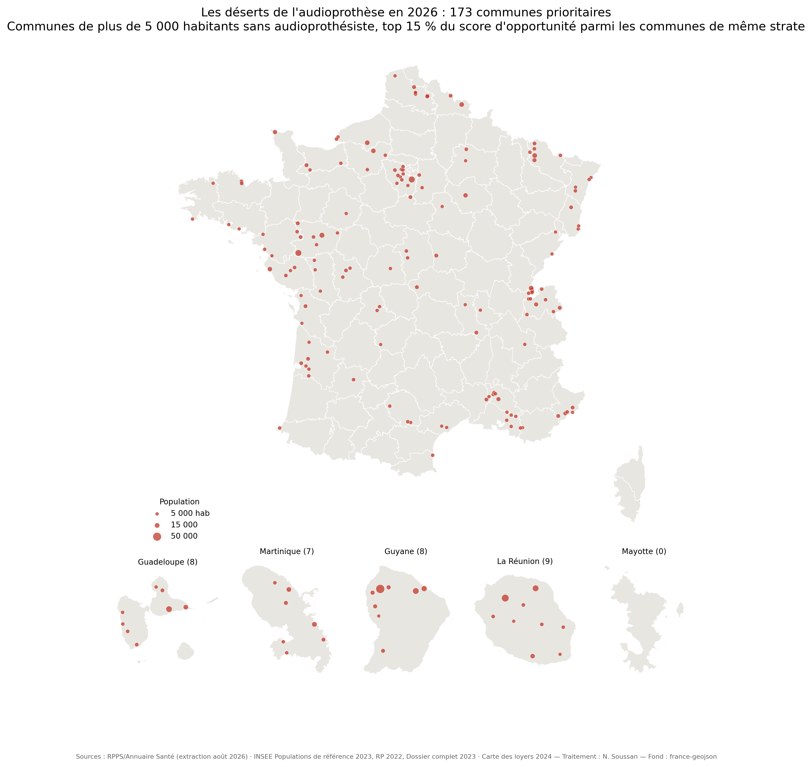

# L'accessibilité de l'audioprothèse en France

Mesure communale de l'accès aux soins audioprothétiques et de l'opportunité d'implantation, sur les 34 900 communes françaises (hors Mayotte), à partir de sources publiques exclusivement — confrontée à la dynamique réelle du marché entre 2022 et 2026.

[](https://doi.org/10.5281/zenodo.22177296)
[](https://doi.org/10.5281/zenodo.22177338)
[](https://doi.org/10.5281/zenodo.22177322)
[](https://doi.org/10.5281/zenodo.22286005)
[](https://github.com/Nsoussan/deserts-audioprothese/releases)

## Résultats principaux (version 2.0, données au 30 août 2026)

- **11 018 activités d'audioprothésistes** recensées (RPPS, août 2026), en croissance de **65 %** par rapport aux 6 682 de 2022 ;
- **560 communes de plus de 5 000 habitants sans audioprothésiste** (4 522 768 habitants), dont **173 classées prioritaires** — une seule ville de plus de 50 000 habitants est concernée dans toute la France : Saint-Laurent-du-Maroni (Guyane), à 146,5 km du professionnel le plus proche ;
- première **accessibilité potentielle localisée (APL)** calculée pour la profession : moyenne nationale pondérée de 77 professionnels accessibles pour 100 000 habitants de 65 ans et plus, contre 38 dans les DOM et 11 en Guyane ;
- **validation rétrospective** : le score publié sur données 2022 est significativement associé aux implantations 2022-2026 (taux d'équipement de 30,8 % à 54,5 % entre quintiles extrêmes ; AUC 0,597, p < 10⁻⁵) ;
- **2 992 communes** cumulent accessibilité faible, population âgée et revenus modestes (2,19 millions d'habitants) ;
- comptages confirmés à **99 %** par croisement avec la Base permanente des équipements (Insee), chaîne administrative indépendante.



L'analyse complète — méthodes, 15 figures, 18 tableaux, 11 annexes dont l'inventaire des 560 communes — figure dans le [rapport scientifique de 81 pages](docs/rapport_v2_scientifique.pdf).

## Ce que contient ce dépôt

| Fichier | Rôle |
|---|---|
| `data/processed/communes_scoring_2026.csv` | Jeu de données auto-suffisant : 34 900 communes × 17 variables (sources, coordonnées, effectifs 2022 et 2026, distance, score, APL) |
| `src/collect_2026.py` | Collecte des sources publiques (RPPS, populations 2023, RP 2022, niveau de vie, loyers) |
| `src/analyses_2026.py` | **Spécification exécutable** : re-dérive score, distances et APL depuis le seul CSV publié et vérifie chaque chiffre clé par assertion |
| `src/rapport_2026.py` | Générateur du rapport PDF (ReportLab, polices embarquées) |
| `outputs/tables/` | Liste prioritaire, comparaison 2022-2026, tables du rapport |
| `docs/` | Rapport v2 (81 p), méthodologie et limites v1 (archive) |
| `data/processed/communes_scoring_2026_v21.csv` | Même jeu, APL recalculée avec les 45 arrondissements de Paris, Lyon et Marseille (v2.1) |
| `data/geo/arrondissements_centroides.csv` · `src/apl_v21.py` | Centroïdes des arrondissements (API Découpage administratif) et recalcul 2SFCA |
| `outputs/tables/apl_v20_v21_comparaison.csv` | Comparaison APL v2.0 / v2.1 par zone |
| `ratings/` | Étude complémentaire *Ratings Without Exit* (document de travail v2.3, 32 p, en anglais, [doi:10.5281/zenodo.22286005](https://doi.org/10.5281/zenodo.22286005), toutes versions) : notes Google d'un échantillon stratifié de 2 999 des 8 421 centres (exhaustif pour les centres à moins de trois concurrents) et concurrence locale, sites web, benchmark coiffeurs ; couche établissement publique `sites_public_v2.csv`, voir `ratings/README.md` |

Version 2.1 (3 septembre 2026) : les 45 arrondissements de Paris, Lyon et Marseille, sans centroïde en v2.0, sont intégrés au calcul 2SFCA ; classements inchangés, APL France 75,7 → 77,7 (détail dans `CHANGELOG.md`). Les chiffres ci-dessus sont ceux du rapport v2.0.

Version 1 (données ADELI 2022, 742 communes sans offre dont 331 prioritaires) : voir la [release v1.0.0](https://github.com/Nsoussan/deserts-audioprothese/releases/tag/v1.0.0) et l'annexe K du rapport pour le tableau complet des évolutions méthodologiques.

## Méthode en bref

Deux indicateurs complémentaires. L'**APL** (méthode 2SFCA, bandes 0-10/10-20/20-30 km, demande restreinte aux 65 ans et plus) mesure l'accès réel en tenant compte du partage de l'offre entre communes voisines. Le **score d'opportunité** (10 critères pondérés sur 80 points : concurrence 14, distance 12, taux d'équipement 10, part des 65+ 10, sous-équipement 9, revenu 8, potentiel 100 % Santé 7, ORL 5, population 3, loyers 2) hiérarchise les communes non couvertes. Est *prioritaire* toute commune ≥ 5 000 habitants, sans activité, dans le top 15 % du score de sa strate. Sensibilité : ±20 % sur chaque poids → recouvrement médian de la liste de 99,4 %.

## Reproduire

```bash
pip install -r requirements.txt
python src/analyses_2026.py   # re-dérive et vérifie tous les chiffres depuis le CSV publié
```

La collecte complète depuis les sources (`src/collect_2026.py`) télécharge ~2 Go et reconstruit la base ; `analyses_2026.py` suffit pour vérifier chaque résultat du rapport.

## Sources

RPPS — extraction en libre accès (ANS, août 2026) · Populations de référence 2023 (Insee, décret n° 2025-1362) · RP 2022 (Insee) · Dossier complet, niveau de vie 2023 (Insee) · Carte des loyers 2024/2022 (MTE/ANIL) · Contours france-geojson · BPE 2025 (Insee, validation). Toutes sous licence ouverte ; détail et millésimes en section 2 du rapport.

## Citation

```bibtex
@techreport{soussan2026audioprothese,
  author      = {Soussan, Nathan},
  title       = {L'accessibilit\'e de l'audioproth\`ese en France : mesure communale
                 de l'acc\`es et de l'opportunit\'e d'implantation, confront\'ee
                 \`a la dynamique du march\'e 2022-2026},
  year        = {2026},
  month       = {8},
  version     = {2.0},
  doi         = {10.5281/zenodo.22177322},
  url         = {https://github.com/Nsoussan/deserts-audioprothese}
}

@techreport{soussan2026ratings,
  author      = {Soussan, Nathan},
  title       = {Ratings Without Exit: Online Reputation and the Option to Switch
                 in a Credence Goods Market. Evidence from hearing-aid centres in France},
  type        = {Working paper},
  year        = {2026},
  month       = {9},
  version     = {2.3},
  doi         = {10.5281/zenodo.22286005},
  url         = {https://github.com/Nsoussan/deserts-audioprothese/tree/main/ratings}
}
```

## Licences

- Code (`src/`, `ratings/*.py`) : licence MIT (`LICENSE`).
- Données produites (`data/processed/`, `outputs/`, `ratings/sites_public_v2.csv`, `ratings/outputs/`) : Licence Ouverte 2.0 (`LICENSE-DATA`). `sites_public_v2.csv` est dérivé de l'extraction publique du RPPS (Agence du Numérique en Santé, août 2026, Licence Ouverte 2.0) et reste joignable au registre par l'identifiant de structure ; sa réutilisation est soumise au RGPD, voir `ratings/DATA-PROTECTION.md`.
- Rapport (`docs/rapport_v2_scientifique.pdf`) et document de travail (`ratings/paper/`) : Creative Commons Attribution 4.0 (CC BY 4.0).

L'auteur est audioprothésiste diplômé d'État, ancien salarié d'un centre Audika, sans lien contractuel ni intérêt financier avec un acteur du secteur au moment de la rédaction ; l'étude n'a bénéficié d'aucun financement.
