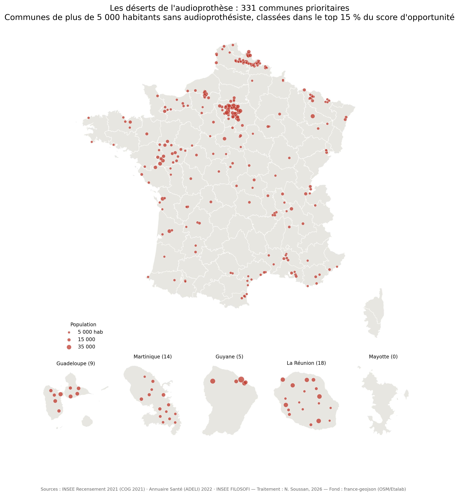

# Les déserts de l'audioprothèse en France

Modèle de scoring géographique identifiant les communes françaises prioritaires pour l'implantation d'un centre d'audioprothèse, à partir de données publiques agrégées à la maille communale.

[](https://doi.org/10.5281/zenodo.22146816)

## Résultats

- **34 965 communes** analysées (Code officiel géographique INSEE, millésime 2021)
- **742 communes de plus de 5 000 habitants** ne comptent **aucun audioprothésiste** installé
- dont **331 classées prioritaires** par le modèle (top 15 % du score d'opportunité)
- Jeu de données publié : **345 980 valeurs** renseignées sur 10 variables par commune



Répartition notable : 46 des 331 communes prioritaires sont situées dans les DOM (18 à La Réunion, 14 en Martinique, 9 en Guadeloupe, 5 en Guyane), et la petite couronne parisienne concentre un cluster dense de communes peuplées sans audioprothésiste.

## La question

L'accès aux soins auditifs est inégal sur le territoire. La densité d'audioprothésistes varie fortement d'une région à l'autre, et les analyses existantes s'arrêtent le plus souvent à la maille départementale ou régionale — trop grossière pour guider une décision d'implantation ou un diagnostic de zone blanche.

Ce projet part d'une question de terrain, née d'une pratique clinique : **où, précisément, manque-t-il des audioprothésistes — et parmi ces zones, lesquelles présentent les conditions démographiques et économiques d'une implantation viable ?** La réponse suppose de descendre à la commune et de croiser plusieurs dimensions : structure d'âge, revenus, offre de soins existante, prescripteurs.

## Les données

| Source | Millésime | Ce qu'on en tire | Licence | Lien |
|---|---|---|---|---|
| INSEE — Recensement de la population | 2021 (COG 2021) | Population, part des 65 ans et plus, densité | Licence Ouverte 2.0 | [insee.fr](https://www.insee.fr) |
| INSEE — FILOSOFI | ~2021 (à confirmer) | Revenu médian disponible par UC | Licence Ouverte 2.0 | [insee.fr](https://www.insee.fr) |
| Annuaire Santé (ADELI, avant bascule RPPS) | 2022 | Nombre d'audioprothésistes et d'ORL libéraux par commune | Licence Ouverte 2.0 | [annuaire.sante.fr](https://annuaire.sante.fr) |
| Observatoire des loyers (parc privé) | ~2022 (à confirmer) | Loyer d'annonce au m² | Voir data/README.md | — |

Le détail de la provenance, des millésimes et des licences figure dans [`data/README.md`](data/README.md). Le jeu de données publié est **agrégé à la maille communale** : il ne contient aucune donnée nominative ni adresse individuelle.

## La méthode

Chaque commune reçoit un score construit sur **10 critères pondérés** (73 points de pondération au total). Chaque variable est normalisée en score 0–1000 (min-max sur l'ensemble des communes), certaines en sens inverse lorsqu'une valeur faible traduit une opportunité (nombre d'audioprothésistes, densité, taux d'équipement).

| Critère | Poids | Sens |
|---|---|---|
| Nombre d'audioprothésistes installés | 14 | inversé |
| Part des 65 ans et plus | 10 | direct |
| Taux d'équipement local (audios / population concernée) | 10 | inversé |
| Habitants par audioprothésiste | 9 | direct |
| Revenu médian disponible par UC | 8 | direct |
| Potentiel 100 % Santé (proxy revenus) | 7 | direct |
| Densité de population | 5 | inversé |
| ORL libéraux (prescripteurs) | 5 | direct |
| Population totale | 3 | direct |
| Loyer au m² | 2 | direct |

La justification de chaque pondération — y compris son caractère en partie normatif — est détaillée dans [`docs/methodologie.md`](docs/methodologie.md). Une commune est dite **prioritaire** si elle compte plus de 5 000 habitants, aucun audioprothésiste, et un score dans le top 15 % national.

## Les limites

Ce modèle a des limites réelles, détaillées dans [`docs/limites.md`](docs/limites.md) : absence de prise en compte des bassins de vie intercommunaux (une commune sans audioprothésiste peut être à dix minutes d'un centre), millésimes hétérogènes des sources, pondérations en partie normatives (testées en sensibilité), et données professionnelles antérieures à la bascule RPPS de 2024.

## Reproduire les résultats

```bash
git clone https://github.com/Nsoussan/deserts-audioprothese.git
cd deserts-audioprothese
pip install -r requirements.txt
bash run_all.sh
```

Le pipeline enchaîne trois étapes : `score.py` (scores et chiffres clés), `join_codes.py` (appariement aux codes INSEE via le référentiel embarqué dans `data/geo/`, ~95 % des communes et 100 % des 331 prioritaires), `make_map.py` (carte PNG et SVG). Testé sous Python ≥ 3.10.

## Citer ce travail

<!-- À compléter avec le DOI Zenodo après la release v1.0.0 -->

```bibtex
@misc{soussan2026deserts,
  author = {Soussan, Nathan},
  title  = {Les déserts de l'audioprothèse en France : scoring d'opportunité à la maille communale},
  year   = {2026},
  doi: 10.5281/zenodo.22146816
  url    = {https://doi.org/10.5281/zenodo.XXXXXXX}
}
```

Dépôts associés : [Rapport (DOI 10.5281/zenodo.22146893)](https://doi.org/10.5281/zenodo.22146893) · [Jeu de données (DOI 10.5281/zenodo.22146965)](https://doi.org/10.5281/zenodo.22146965)

## Auteur et licences

Nathan Soussan — audioprothésiste diplômé d'État. Travail mené à titre personnel, sans rattachement institutionnel.

- Code : licence MIT ([`LICENSE`](LICENSE))
- Données : Licence Ouverte 2.0 / Etalab ([`LICENSE-DATA`](LICENSE-DATA)), sous réserve de la vérification source par source documentée dans `data/README.md`
