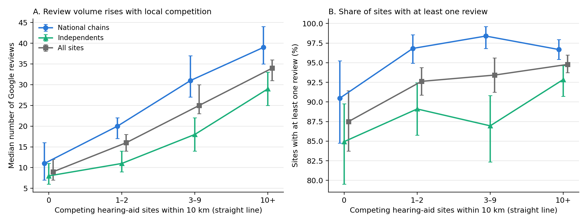
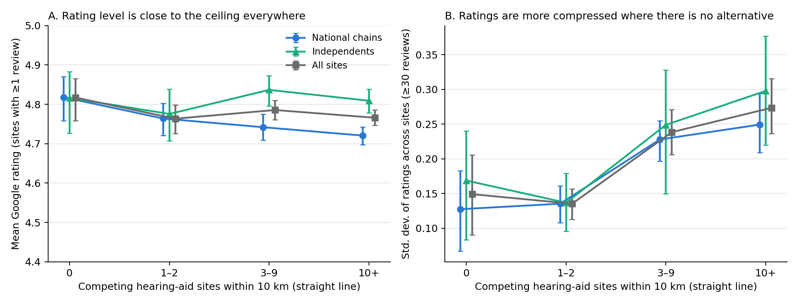

# Online ratings of hearing-aid centres in France and local competition

**A descriptive note** · Nathan Soussan · 3 September 2026 · companion to *L'accessibilité de l'audioprothèse en France* (v2.0, DOI 10.5281/zenodo.22177322)

This note follows a suggestion made by Wanda Mimra (ESCP) after reading the accessibility study: look at what providers communicate online and at online ratings, and see whether they correlate with the study's measures of local competition and accessibility. Everything below is descriptive. Nothing here identifies a causal effect, and the last section says what the data cannot tell.

## Summary

Google ratings for hearing-aid centres in France are comprehensive: in a stratified sample of 2,999 sites, 99.9 % have a Google listing, 98.9 % match the RPPS record on name, type and location, and 93.3 % of matched sites carry at least one review. Coverage is therefore not the obstacle it was for Zurich dentists in 2016.

Reputation *activity* rises steeply with local competition. The median site with no competing centre within 10 km has 9 reviews; with one or two competitors, 16; with three to nine, 25; with ten or more, 34. The share of sites with at least one review rises from 87.5 % to 94.8 % across the same bands. Both gradients survive controls for commune population and median income, and hold within national chains and within independents.

Reputation *content* does not discriminate. The mean rating is between 4.76 and 4.82 in every competition band, with no significant band effect once site type is controlled. Where there is no alternative, ratings are not lower; they are thinner (fewer reviews) and, among well-reviewed sites, more compressed: the standard deviation of ratings across sites with 30 or more reviews is 0.15 with no competitor within 10 km and 0.27 with ten or more.

National chains collect more reviews than independents at any level of competition (median 33 against 23; 97 % against 91 % with at least one review), which is consistent with systematic solicitation of reviews by chains. Independents are rated slightly higher on average (+0.07) and are twice as likely to carry an exact 5.0, but the excess of perfect scores is entirely explained by their smaller review counts. Websites are near-universal (93 % of sites, 99 % of chains, 88 % of independents) and unrelated to competition.

## Data and method

**Sites.** The RPPS public extraction of August 2026 (*Personne_activite*, 2.28 million rows) lists every audiologist activity with the address, legal name and trade name of the site. Deduplicating by site identifier gives 8,481 sites, of which 8,421 are in the "medical devices" sector (the others are hospitals, dental centres and institutes where audiologists are employed; they are excluded). Each site carries the number of practitioners, the commune-level variables of the accessibility study (population, share aged 65 and over, median income, APL), and the number of other hearing-aid sites within 10, 20 and 30 km (great-circle distance between commune centroids). Sites are classified by trade name and legal name into national chains (3,816 sites; Amplifon, Audika, Optical Center, Audition Santé, Audilab, Alain Afflelou Acousticien, Krys Audition and others), mutualist networks (525; Écouter Voir, VYV3, Mutualité) and independents or other (4,140). The classification is keyword-based and can be refined.

**Competition bands.** Sites are grouped by the number of competing sites within 10 km: none (291 retail sites nationally), 1 to 2 (754), 3 to 9 (1,903) and 10 or more (5,473). At 30 km almost every site in mainland France has ten or more competitors, so the 10 km radius is the one that discriminates. The band is strongly correlated with commune size; regressions below control for it.

**Sample.** All 1,045 retail sites with 0 to 2 competitors within 10 km, plus a random sample of the others, proportional by site type, for a total of 2,999 sites. Sampling weights (1 for the exhaustive strata, about 3.8 for the others) restore national proportions in every figure and table.

**Ratings.** Collected on 3 September 2026 through the official Google Places API (New), one Text Search on name and address biased around the commune centroid, then one Place Details call per site: rating, number of reviews, website, business status, place type. Matches were validated on distance (within 10 km), place type and name concordance; 225 doubtful matches were re-queried with the chain name and "audioprothésiste"; 33 sites remain unmatched and are excluded. Sites hosted in an optician's shop (Optical Center, Krys, Afflelou, Atol, Optic 2000; 323 sites in the sample) carry the shop's listing and reviews and are flagged separately.

## Results

*Figure 1. Review activity by local competition. Weighted medians and shares, 95 % bootstrap intervals. Independents and national chains shown separately; mutualist networks (173 sites) are in "all sites" only.*

Review volume rises with competition in every group (Figure 1A; Kruskal-Wallis on review counts, p < 10⁻⁵⁰). In a weighted regression of log(1 + reviews) on competition bands, site type, log population, median income and the optician flag, the band coefficients are +0.32, +0.57 and +0.68 relative to sites with no competitor (all p ≤ 0.001), log population adds +0.16 per log point, independents have 17 % fewer reviews than chains, and optician-hosted sites have three times more. The share of sites with at least one review follows the same gradient (Figure 1B), with independents about six points below chains throughout.

*Figure 2. Rating content by local competition. A: weighted mean rating among sites with at least one review. B: weighted standard deviation of ratings across sites with 30 or more reviews. 95 % bootstrap intervals.*

The mean rating is flat (Figure 2A). In the same regression specification, no competition band differs from the no-competitor reference (all p > 0.15); independents are rated 0.07 higher than chains and optician-hosted sites 0.06 lower. Perfect scores are more frequent where competition is absent (50.6 % of rated sites against 34.9 % with ten or more competitors), but this is a review-count effect: conditional on log(reviews), the band coefficients are zero, and the share of 5.0 falls to 33.6 % against 28.8 % among sites with at least ten reviews. What does vary is dispersion (Figure 2B): among sites with 30 or more reviews, the cross-site standard deviation of ratings roughly doubles from the no-competitor band to the ten-or-more band, and the share of ratings below 4.5 goes from 3.5 % to 8.3 %.

| Competitors within 10 km | Sites (sample) | With ≥ 1 review | Median reviews | Mean rating | Rated 5.0 | SD of ratings (≥ 30 reviews) | Website |
|---|---|---|---|---|---|---|---|
| 0 | 291 | 87.5 % | 9 | 4.82 | 50.6 % | 0.15 | 92.1 % |
| 1–2 | 754 | 92.6 % | 16 | 4.76 | 40.1 % | 0.14 | 94.6 % |
| 3–9 | 504 | 93.4 % | 25 | 4.79 | 32.2 % | 0.24 | 95.0 % |
| 10+ | 1,450 | 94.8 % | 34 | 4.77 | 34.9 % | 0.27 | 93.0 % |

*Weighted by sampling weights. Full tables by band, by type and by band × type are in `outputs/`.*

Accessibility as measured by the study's APL is only weakly related to ratings: Spearman ρ = 0.14 with the number of reviews (p < 10⁻¹³) and 0.03 with the rating level (p = 0.09). The APL measures supply per older resident within 30 km; the competition bands measure the number of alternatives within 10 km. The two are related but not the same, and it is the second that tracks review activity.

## Reading in the credence-goods frame

The pattern is consistent with a simple reading: the reputation mechanism is *active* in proportion to the patient's option to go elsewhere, and its *content* is close to the ceiling wherever it is observed. Where a centre is the only one within 10 km, the signal exists (nine reviews at the median, 87 % of sites rated) but it is thin and compressed; where alternatives abound, it is thicker and more dispersed. Whether the dispersion reflects more information reaching patients, more heterogeneous providers, or simply more reviewers, the data cannot say.

## What this does not show

The competition bands are not exogenous: the number of competitors within 10 km is largely a measure of urban density, and although population and income are controlled, unobserved local factors (demographics, mobility, digital habits of older patients) are not. Reviews are self-selected and, for chains, solicited; the number of reviews measures reputation activity, not patient flow. A Google rating measures reported satisfaction, not the appropriateness of treatment, which is the credence-good problem itself: a satisfied patient may have been over-fitted. Google is one platform; the study's competition measure uses straight-line distances between commune centroids; Paris, Lyon and Marseille arrondissements are attached to the city centroid. The sample over-represents low-competition sites by design and is re-weighted. Website content (price display, mention of the fully reimbursed class I devices) has not been coded; only the presence of a website on the Google listing is observed. This is the next step.

## Reproducibility and data terms

`build_sites.py` rebuilds the site layer from the RPPS extraction and the published commune dataset; `collect_places.py` and `requery_mismatches.py` run the collection against the official API with the user's own key; `analyze_ratings.py` produces every number and figure in this note. Site-level Google data (ratings, review counts, place identifiers) are not redistributed, in line with the Google Maps Platform terms; the aggregated tables in `outputs/` and the site layer without Google fields (`sites_audio_2026.csv`, `sample_3000.csv`) are published. Anyone with a Places API key can re-run the collection in about an hour for a few tens of dollars.
