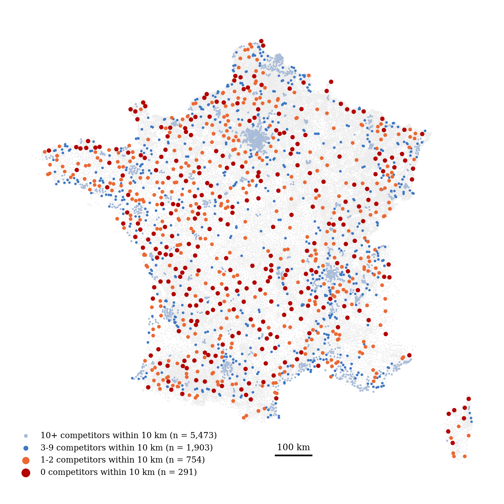
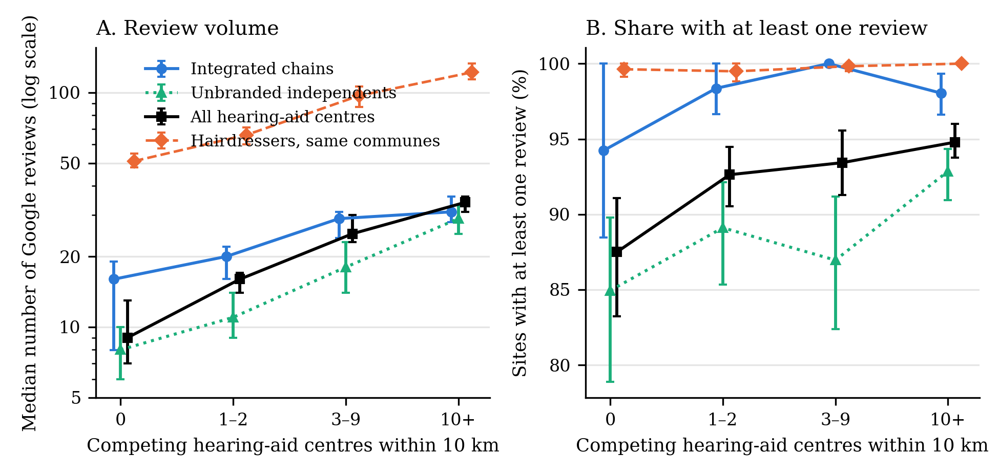

*Keywords:* credence goods, rating systems, reputation, competition, healthcare, hearing aids. *JEL:* D82, I11, L15, D83.

# Introduction

In a credence goods market the seller knows what the buyer needs and the buyer cannot verify, even after the fact, whether what was sold was what was needed (Darby and Karni, 1973; Dulleck and Kerschbamer, 2006). Healthcare is the canonical case. Angerer, Glätzle-Rützler, Mimra, Rittmannsberger and Waibel (2026) show in the laboratory that a five-star public rating system goes a long way towards solving the problem: in markets of four experts and four consumers, ratings cut undertreatment from 52 % to 7 % of interactions and overcharging from 86 % to 44 %. The mechanism is reputation through choice. Consumers rate the outcomes they can observe, and in the next period they visit the best-rated expert. An expert who cannot lose a consumer has nothing to fear from a rating.

The experiment holds fixed what field markets vary: the choice set. Every consumer in every period picks from a list of four experts, and the authors note that their design maintains competition throughout. This paper takes the choice set as the variable of interest. In Hirschman's (1970) terms, a rating is voice, and its disciplining power in these models comes from the exit it enables, or more precisely from the selection it allows the next consumer to make. Where there is no other provider within reach, voice has no exit to lean on. The question is what a public rating system then looks like: whether consumers still rate, whether ratings still differ across providers, and whether providers still respond.

The market is hearing-aid provision in France, a credence good in the strict sense: the practitioner, the *audioprothésiste*, assesses the hearing loss, selects and programmes the device, sells it and adjusts it over years, and the patient, typically elderly, cannot tell whether a different device, a different setting or no device would have served as well. It is also a market with a documented geography. A companion study (Soussan, 2026) measures accessibility for all 34,900 French communes and finds 560 towns of more than 5,000 inhabitants without a practitioner, alongside cities where dozens of centres compete within a few kilometres. The choice set that the laboratory fixes at four here runs from zero to more than fifty within 10 km.

I rebuild the population of hearing-aid centres from the public extraction of the national register of health professionals: 8,421 retail sites, each attached to the accessibility measures of the companion study and to the number of other centres within 10 km. For a stratified sample of 2,999 sites that includes every site with fewer than three competitors, I collect through the official Google Places API the rating, the number of reviews, the website and the business status of the matching listing; I read and code the content of 2,702 provider websites; and, to separate what is specific to a credence good from what is a property of the platform, I collect the ratings of 2,574 hairdressers in 879 of the same communes.

Three facts organise the paper. First, rating activity follows the choice set. The median centre with no competitor within 10 km has 9 reviews and 87.5 % of such centres are rated at all; with ten or more competitors, the median is 34 and 94.8 % are rated. The gradient survives controls for commune population, income, older population per centre and staff, with standard errors clustered by commune, and it is twice as steep as the one hairdressers display in the same communes. Second, rating levels do not follow the choice set, and this is not specific to the credence good: hearing-aid centres average 4.77 stars and hairdressers 4.74, in every competition band. Third, what competition changes is the variation of ratings across providers. Among the best-reviewed quarter of centres in each market, the standard deviation of ratings across centres is 0.14 to 0.15 where a centre has two or fewer competitors and 0.25 to 0.30 where it has three or more; the difference holds within a fixed window of review counts, with or without the optician corners, and under a bootstrap by commune. Of the 236 best-reviewed centres with two or fewer competitors, five are rated below 4.5; of the 459 with three or more, 56 are. Hairdressers in the same communes show a spread of 0.21 to 0.25 and a low tail of one salon in ten at every level of competition.

Two further results concern the supply side. Conditional on local competition and organisational form, a centre where the practitioner is the owner, as the register records it, collects 31 % fewer reviews than a centre staffed by employees, and the gap does not vary with competition; the differences between chains and independents that appear in raw comparisons reduce to this. And the information that providers put on their own websites, price display in particular, is a brand policy: it does not vary with local competition among independents and is unrelated to ratings.

The paper is descriptive and says so. The number of competitors within 10 km is not exogenous; it is largely a measure of urban density, and the hairdresser benchmark controls for the place but not for the patient. Reviews are self-selected and, in chains, solicited. A rating measures reported satisfaction, not the appropriateness of the treatment, which no observational dataset in this market contains. Section 7 lists these limits. What the paper offers is the field counterpart of a laboratory result: the variable the experiment held constant is the one along which, in the market, the activity of the rating system and its variation across providers move.

The paper relates to three strands of work. It follows the literature on institutions that mitigate expert opportunism in credence goods markets, from Dulleck and Kerschbamer (2006) and Dulleck, Kerschbamer and Sutter (2011) to the review by Balafoutas and Kerschbamer (2020), and in particular the result of Mimra, Rasch and Waibel (2016) that price competition undermines reputation building. It adds to the small field literature on online ratings in expert markets: Kerschbamer, Neururer and Sutter (2023) find in a field experiment on computer repair that better-rated shops charge lower prices, while systematic reviews find at best a weak relationship between physician ratings and clinical outcomes (Hong et al., 2019; Saifee et al., 2020). And it builds on Gottschalk, Mimra and Waibel (2020), who sent a test patient to 180 Zurich dentists and found that unnecessary treatment recommendations were unrelated to the density of dentists but related to a dentist's spare capacity, to the patient's socio-economic status, and to whether the dentist displayed the legally required price information. Their density variable ranged from zero to sixty competitors within 500 metres; the present data extend the range to markets where the nearest competitor is tens of kilometres away.

# The market

Hearing aids in France are dispensed by *audioprothésistes*, a regulated profession that requires a state diploma. A medical prescription is required for a first fitting, from an ear, nose and throat specialist or a general practitioner with otological training; renewals, after four years, may be prescribed by any physician (Assurance Maladie, 2026). In the taxonomy of Dulleck and Kerschbamer (2006), the prescription verifies the need for a device, not the choice of device, its price or its programming, which remain the practitioner's; the credence-good problem concerns these.

Since 2019 devices fall in two classes. Class I devices are price-capped at 950 euros per ear for adults, come with a four-year guarantee, and since 2021 are covered in full by the combination of statutory and complementary insurance, so that the patient pays nothing. Class II devices are freely priced and reimbursed on the same statutory base of 400 euros, of which 60 % is paid by the statutory insurer, the rest falling on complementary insurance and the patient. Every sale must be preceded by a standardised quote separating the device from the fitting services, and by a trial period of at least thirty days (Assurance Maladie, 2026). The reform changed the supply side: the companion study counts 6,682 registered activities in 2022 and 11,018 in August 2026, a figure it treats as an upper bound on real growth because the two vintages come from different registers and count activities rather than practitioners, but whose direction is not in doubt.

The profession has no professional order, and advertising is permitted; the largest chains advertise on television. Supply is organised in five ways, and the register makes the distinction observable. National chains such as Amplifon, Audika and Audition Santé operate integrated networks in which the practitioner is a salaried employee: 6 % or fewer of their sites have a practitioner registered as owner. A second group of brands, among them Audition Conseil, Entendre, Sonance and Audio 2000, are networks of independent owners trading under a common name: between roughly half and three quarters of their sites have an owner-practitioner. A third group are hearing-aid corners inside optician shops (Optical Center, Krys, Alain Afflelou, Atol), whose Google listing is the shop's. Mutualist networks (Écouter Voir, VYV3, regional *mutualités*) employ salaried practitioners. The rest are unbranded independents, two thirds of them owner-operated. The distinction matters for the reputation mechanism in two ways. Integrated chains run centralised marketing, which in the author's experience of the profession includes the solicitation of Google reviews after the fitting, a practice the data do not observe; and the owner-practitioner is the residual claimant of the sale, the position that Gottschalk, Mimra and Waibel (2020) found to matter for overtreatment.

The companion study describes the geography. It computes, for every commune, a two-step floating catchment measure of potential accessibility with demand restricted to residents aged 65 and over and distance bands of 10, 20 and 30 km, and finds that most of the 560 unserved towns lie within a few kilometres of a served one, while a residual set of communes, overseas and in rural areas with old and poor populations, has no practitioner within reach. This paper uses the finer fact: for a given centre, how many other centres a patient could reach within 10 km.

# Data

## The site layer

The public extraction of the RPPS (*Répertoire partagé des professionnels intervenant dans le système de santé*, Agence du Numérique en Santé, August 2026 vintage, 2.28 million activity rows) lists each practitioner's activities with the identifier, legal name, trade name, address and sector of the site, and the practitioner's mode of practice. Filtering on the profession label and deduplicating on the site identifier yields 8,481 sites at which at least one *audioprothésiste* is registered; 60 of them are hospitals, dental centres and institutes where audiologists are employed but no retail activity takes place, leaving 8,421 retail sites. Each site carries the number of registered practitioners (1.3 on average), whether at least one of them is registered as owner of the practice, and a classification into the five organisational forms of Section 2. The classification uses the trade name and, where the trade name is missing, the legal name (SOGECA for Audika, Sonova for Audition Santé); a brand is counted as a network of independents when at least 45 % of its sites have an owner-practitioner, a rule that separates the two groups cleanly (Table A5). Sites are located at the centroid of their commune, using the coordinates of the companion study; the arrondissements of Paris, Lyon and Marseille, which that study had left without coordinates, are attached to their own centroids.

Each site inherits its commune's population (2023), share of residents aged 65 and over (2022 census), median income per consumption unit (2023) and accessibility index, and receives the competition measures: the number of other retail sites within 10 km of great-circle distance between centroids, the distance to the nearest other site, the number of distinct alternatives within 10 km (a brand's several sites counting once), and the population aged 65 and over within 10 km divided by the number of sites there, a measure of demand per centre. The 10 km radius is the one that discriminates: within 30 km, 97 % of retail sites have ten or more competitors, whereas within 10 km 291 retail sites have none, 754 have one or two, 1,903 have three to nine and 5,473 have ten or more. Counting distinct alternatives rather than sites moves 63 sampled sites across bands and changes no coefficient by more than 0.02 (Table A1). Figure 1 maps the four groups.

## Sample and weights

The sample takes every retail site with zero to two competitors within 10 km (1,045 sites) and a random draw, proportional by organisational form, from the two other bands, for a total of 2,999 sites. Sampling weights, equal to 1 in the exhaustive strata and about 3.8 in the others, restore national proportions in every table and figure; the order of collection was randomised. Table A3 gives the design.

## Google ratings

Ratings were collected on 3 September 2026 through the Google Places API (New), in two calls per site: a text search on the site's name and address, biased towards the commune centroid and returning only a place identifier, then a place-details call returning the display name, address, coordinates, rating, number of reviews, website, business status and place type. A match was accepted when the returned location lay within 10 km of the commune centroid, the place type was compatible with a retail centre and the name matched, and 225 doubtful matches were re-queried with the brand name followed by *audioprothésiste* and the commune. In the end 2,997 sites had a listing and 2,966 (98.9 %) a validated match, in 1,782 communes; 2,768 of the matched sites (93.3 %) carried at least one review, and 31 (1.0 %) were flagged by Google as closed, with no relation to competition; they are kept. The 33 unmatched sites are more frequent where there is no competitor (11 of 291, against 12 of 1,450 with ten or more); they are treated as missing in the main tables and as unrated in a robustness check that slightly strengthens the activity gradient (Table A1). The 2,966 matches point to 2,880 distinct listings: 171 register structures, 94 % of them in the same commune, share a listing with another, typically a change of legal entity at the same address or a corner and its host; keeping one structure per listing changes no result (Table A1).

All Google fields are a snapshot of what the API returned on that day. Listings, ratings and review counts change continuously, so a later collection will not reproduce the figures exactly. Only the fields listed above were requested: no review text and no information about reviewers. The coordinates returned by the API were used solely to validate the match; every distance and competition measure rests on commune centroids. The Google Maps Platform terms of service restrict the storage and redistribution of Places content; accordingly no site-level Google field is redistributed and none appears in this paper, which reports only statistics aggregated over groups of sites. The collection script, field mask and matching rules are published with the code; re-running the collection requires an API key, incurs charges at the rates in force, and returns the platform's state at the time of the run.

## Website content

For each matched site with a website in its listing (2,778 sites, 640 distinct domains), the page referenced by the listing was read once per site, and the domain's home page and up to three internal pages whose address or link text refers to prices, the *100 % Santé* scheme or a free trial were read once per domain, between 3 and 4 September 2026, with an identified user agent naming the study, in compliance with each domain's robots.txt, at no more than one request per second. The text was coded automatically for the display of the provider's own prices (an amount between 100 and 20,000 euros in a price context, excluding reimbursement explanations, the regulatory amounts of 240, 400, 840, 1,400 and 1,700 euros, and quoted customer reviews), a page dedicated to hearing-aid prices, a mention of the fully reimbursed class I devices, of class II devices, of a free trial, of a free hearing test, of online booking, of a quote and of guarantee or follow-up terms. The raw text was retained only for coding and is not redistributed. Chain websites are national, so for chains these variables describe the brand; for independents they describe the centre. In all, 2,702 sites (91 % of matched sites) have a readable website; the 76 that do not are dead links, time-outs or domains that exclude automated readers.

## A benchmark that is not a credence good

To tell what is specific to the credence good from what is a property of the platform and of the place, the same collection was run for hairdressers. In 879 communes of the sample, all 280 in which the hearing-aid centre has no competitor and 200 drawn at random from each other band, a text search for *coiffeur* biased towards the commune centroid returned up to three salons, whose rating, number of reviews and status were collected in the same way; 2,574 salons within 10 km of the centroid and not flagged as closed enter the benchmark. Hairdressing is an experience good, local, frequent, delivered to the same population by small firms and, in the same communes, by the same reviewers. The three salons are those the text search ranks first, which favours listings with many reviews: in a small commune they are the population of salons, in a large one the top of a much larger set. This selection inflates the hairdressers' activity gradient and, if anything, compresses their low tail in dense markets; both work against the contrasts reported below. No measure of competition among salons was built; the hairdressers' figures are reported on the hearing-aid competition bands, which stand in for the size of the local market.

## Data protection

The register extraction is released under the Licence Ouverte 2.0 and contains the names and professional addresses of registered practitioners. Names were used only to classify sites by brand. The published site layer contains no practitioner-level information (no name, registration number, mode of practice or street address) and locates sites at the commune, the resolution used throughout; it carries the register's structure identifier, the commune code, the organisational form, the brand for chains and networks, the owner flag, the number of registered practitioners, the competition measures, the sampling stratum and weight and the coded website variables. Google ratings were linked to sites only in a working file held by the author, retained until the final version of this paper for replication requests answered by re-analysis, and are not shared in any site-level form. The processing serves research purposes on the basis of the author's legitimate interest with the safeguards of Article 89 of the GDPR; no restricted-access data were used and no patient or practitioner was contacted.

# Empirical approach and expectations

The analysis is descriptive throughout: weighted means and medians by competition band with bootstrap intervals resampled by commune, weighted least squares with standard errors clustered by commune (by domain for the website regressions), a Poisson pseudo-maximum-likelihood regression for review counts, and commune fixed effects for the comparison of organisational forms within a market. The competition band is the number of other retail sites within 10 km in four classes: none, one to two, three to nine, ten or more. Controls are the log of commune population, median income, the log of the older population per centre within 10 km, the share of residents aged 65 and over, the number of practitioners on site, the owner flag and the organisational form.

The laboratory result of Angerer et al. (2026) suggests four expectations, which are mine and not the authors'. Rating activity, the share of centres rated and the number of reviews per centre, should rise with the number of alternatives, because rating is part of a choice process that has no object where there is nothing to choose between; but review volume is the product of patient flow, the propensity to review, solicitation and the age of the listing, and only the first and last are partly controlled (H1). The level of ratings should be high everywhere, because the outcomes a hearing-aid patient observes are those of a good experience and the outcomes that would justify a low rating are those the credence good hides; the hairdresser benchmark tells whether the level is a property of the good or of the platform (H2). If ratings carry any information about providers, their dispersion across providers should be larger where consumers compare providers, either because comparison makes reviews more discriminating or because heterogeneous providers coexist only in denser markets; the hairdresser benchmark tells whether the dispersion is a property of the place (H3). And the owner-practitioner, who bears the reputational cost of soliciting reviews from patients he will see again, should show lower rating activity than the salaried practitioner of an integrated chain, whatever the local competition (H4).

# Results

## Descriptive statistics

Table 1 describes the matched sample by organisational form and by competition band. Two features frame what follows. Organisational forms differ in review volume and rating level: integrated chains and optician corners have the most reviews and the lowest ratings, brand networks and unbranded independents the fewest reviews and the highest ratings. And the competition bands differ in almost everything: a centre with no competitor within 10 km sits in a commune of 3,700 inhabitants on average, 15 km from the nearest other centre, with an accessibility index of 54; a centre with ten or more competitors sits in a commune of 61,000, 300 metres from the nearest other centre, with an index of 97. The share of owner-operated centres is higher in the first band (52 %) than in the others (43 to 44 %).

Table 1. Descriptive statistics, matched sample (weighted).

| | Integrated chains | Brand networks | Optician corners | Mutualist networks | Unbranded independents | All |
|---|---|---|---|---|---|---|
| Sites in sample | 649 | 362 | 323 | 173 | 1,459 | 2,966 |
| Owner-practitioner on site | 6 % | 62 % | 41 % | 4 % | 64 % | 44 % |
| Practitioners on site | 1.45 | 1.46 | 1.26 | 1.33 | 1.29 | 1.34 |
| Competitors within 10 km | 78.9 | 45.4 | 72.4 | 29.3 | 86.7 | 75.1 |
| Sites with ≥ 1 review | 98 % | 96 % | 96 % | 96 % | 91 % | 94 % |
| Median reviews | 29 | 24 | 152 | 27 | 23 | 28 |
| Mean rating (rated sites) | 4.70 | 4.86 | 4.69 | 4.77 | 4.81 | 4.77 |
| Website on listing | 99 % | 100 % | 99 % | 96 % | 88 % | 94 % |

| | 0 competitors | 1–2 | 3–9 | 10+ |
|---|---|---|---|---|
| Sites in sample | 280 | 746 | 502 | 1,438 |
| Owner-practitioner on site | 52 % | 43 % | 44 % | 44 % |
| Distance to nearest centre (km) | 15.0 | 1.6 | 0.6 | 0.3 |
| Commune population | 3,735 | 5,807 | 14,452 | 61,278 |
| Median income (k€) | 24.0 | 24.4 | 24.4 | 26.2 |
| Accessibility index (APL) | 54 | 61 | 69 | 97 |
| Sites with ≥ 1 review | 87.5 % | 92.6 % | 93.4 % | 94.8 % |
| Median reviews | 9 | 16 | 25 | 34 |
| Mean rating (rated sites) | 4.82 | 4.76 | 4.79 | 4.77 |

*Source: author's calculations from the RPPS public extraction (Agence du Numérique en Santé, August 2026, Licence Ouverte 2.0) and the Google Places API (New), collected 3 September 2026. Weighted by sampling weights.*

## Rating activity follows the choice set

Figure 2 shows the first result. The median number of reviews rises from 9 with no competitor to 16, 25 and 34 across the bands (panel A), and the share of sites with at least one review from 87.5 % to 94.8 % (panel B). The gradient is present within integrated chains and within unbranded independents; the interactions between the bands and the independent indicator are −0.22, −0.23 and 0.00 (standard errors 0.18 to 0.21), and a Wald test does not reject equality of the gradients (p = 0.19). The hairdressers of the same communes, plotted as the dashed line, are rated in 99.5 to 100 % of cases in every band, and their median review count rises from 51 to 122.

Table 2 reports the regression counterpart. In a weighted regression of log(1 + reviews) on the competition bands, the organisational form, the owner flag, the number of practitioners, log population, median income, the log of the older population per centre and the share of residents aged 65 and over, with standard errors clustered by commune, the band coefficients are 0.34, 0.59 and 0.72 relative to sites with no competitor, all significant at the 1 % level. Log population adds 0.12 per log point; the demand-per-centre measure adds nothing once the bands are in. A Poisson regression on the count of reviews gives band effects of 0.48, 1.04 and 1.30. Replacing the bands by continuous measures, the log of one plus the number of competitors enters at 0.09 (s.e. 0.03) and the log of the distance to the nearest centre at −0.18 (s.e. 0.05). The probability of having at least one review follows the same pattern, with band effects of 6 to 8 points. Excluding optician corners, recoding unmatched sites as unrated, counting distinct alternatives instead of sites, or keeping one structure per Google listing, leaves these results in place (Table A1).

Table 2. Rating activity and content: weighted least squares, standard errors clustered by commune.

| | log(1 + reviews) | ≥ 1 review | Rating (if ≥ 1 review) |
|---|---|---|---|
| 1–2 competitors | 0.335 (0.109)*** | 0.056 (0.024)** | −0.057 (0.038) |
| 3–9 competitors | 0.592 (0.140)*** | 0.066 (0.027)** | −0.018 (0.039) |
| 10+ competitors | 0.724 (0.149)*** | 0.079 (0.028)*** | −0.045 (0.043) |
| Brand network | 0.097 (0.098) | −0.029 (0.015)** | 0.131 (0.022)*** |
| Optician corner | 1.169 (0.111)*** | −0.025 (0.013)* | −0.035 (0.025) |
| Mutualist network | 0.001 (0.108) | −0.015 (0.016) | 0.066 (0.035)* |
| Unbranded independent | −0.010 (0.080) | −0.073 (0.012)*** | 0.077 (0.022)*** |
| Owner-practitioner on site | −0.371 (0.077)*** | 0.004 (0.012) | 0.059 (0.018)*** |
| Practitioners on site | 0.242 (0.038)*** | 0.021 (0.005)*** | −0.034 (0.013)*** |
| log commune population | 0.119 (0.033)*** | −0.002 (0.005) | −0.008 (0.008) |
| log older population per centre | 0.073 (0.093) | 0.025 (0.015) | −0.033 (0.023) |
| Share aged 65+ (points) | −0.009 (0.005)* | −0.001 (0.001) | 0.000 (0.001) |
| Median income (k€) | 0.017 (0.007)** | 0.003 (0.001)*** | 0.003 (0.002) |
| Observations | 2,966 | 2,966 | 2,768 |
| R² | 0.136 | 0.028 | 0.041 |

*Reference: integrated chain with no competitor within 10 km. Column 2 is a linear probability model. Sampling weights; standard errors clustered by commune (1,782 clusters). \*\*\* p < 0.01, \*\* p < 0.05, \* p < 0.10.*

The hairdresser benchmark puts the gradient in perspective. In the 879 communes of the benchmark, with the same bands and controls for population and income only, the hearing-aid centres' review counts rise by 0.34, 0.74 and 0.68 log points across the bands and the hairdressers' by 0.09, 0.26 and 0.34; the log population coefficient is 0.21 for the centres and 0.33 for the salons. The hairdressers' regression contains no measure of competition among salons, so the comparison is between a gradient net of town size and one that stands in for it; on that comparison, review volume for the credence good rises with the number of alternatives well beyond what the size of the town explains.

## Rating levels sit near the ceiling for everyone

The third column of Table 2 and panel A of Figure 3 show the second result. The mean rating among rated centres is 4.82, 4.76, 4.79 and 4.77 across the bands; no band coefficient is distinguishable from zero. Hairdressers in the same communes average 4.74, 4.73, 4.74 and 4.73. The near-ceiling level is therefore not specific to the credence good: an experience good rated on the same platform by the same population of reviewers sits at the same level, and neither level varies with the local choice set. The rating column of Table 2 is conditional on being rated, a selection that varies from 87.5 % to 94.8 % across bands.

Conditioning on an established score changes the picture slightly and in one direction. Among centres with at least ten reviews, those with three or more competitors are rated 0.07 to 0.08 lower than those with none (p = 0.02 to 0.04); among centres with at least thirty reviews, 0.07 lower (p = 0.06 to 0.07). Weighting each centre's rating by its number of reviews, which approximates the rating an arriving patient reads, gives 4.87 and 4.85 in the two captive bands against 4.64 and 4.60 in the two competitive ones (4.87, 4.84, 4.64 and 4.58 without the optician corners). Captive markets are not rated lower; if anything their established providers are rated higher.

The excess of perfect scores in captive markets is a review-count artefact. Exactly 5.0 is the rating of 50.6 % of rated sites with no competitor and 34.9 % of those with ten or more, but a site with three reviews is far more likely to sit at 5.0 than a site with eighty; conditional on the review-count bin, the band coefficients in a regression of the perfect-score indicator are zero (Table A2). Two supply-side differences survive that control: unbranded independents are 25 points more likely to carry a perfect score, and owner-operated centres 10 points more.

## Ratings vary across providers only where there is choice

What competition changes is the spread of ratings across providers. Because the dispersion of a mean rating falls mechanically with the number of reviews, and because review counts rise with competition, comparing all rated sites would confound the two. Panels B and C of Figure 3 therefore compare, within each band, the top quarter of sites by number of reviews, which selects the same share of sites in every band: 62 centres with at least 29 reviews where there is no competitor, 341 with at least 87 where there are ten or more (Table A2). The selection works against the result: a mean of 29 ratings is noisier than a mean of 87, so dispersion should, on this account alone, be larger in the captive bands.

It is smaller by half. Among these well-reviewed centres the standard deviation of ratings across sites is 0.150 with no competitor, 0.139 with one or two, 0.248 with three to nine and 0.298 with ten or more. The difference between the two captive and the two competitive bands, a grouping chosen after inspection of the four, is 0.145, with a 95 % interval from 0.095 to 0.200 obtained by a bootstrap by commune; a Levene-type regression of the absolute deviation from the band median on the bands and the organisational form, with standard errors clustered by commune, rejects equality across the four bands (p = 0.001) and gives a linear trend of 0.023 per band (p = 0.006). The pattern does not depend on the selection rule: within a fixed window of 30 to 90 reviews, where the noise of the mean is comparable across bands, the standard deviations are 0.16, 0.13, 0.23 and 0.25 (interval for the difference, 0.05 to 0.17). Nor does it depend on the optician corners, whose listings are the shop's: without them, the top-quarter standard deviations are 0.15, 0.13, 0.21 and 0.30 (interval 0.06 to 0.22), and keeping one structure per Google listing changes nothing. The fact that the band with one or two competitors behaves like the band with none, while its review volume has already risen by a third of a log point, is a result in itself: one or two alternatives within 10 km raise rating activity but do not restore variation across providers.

The low tail tells the same story descriptively and a more cautious one formally. Of the 236 best-reviewed centres with two or fewer competitors, five are rated below 4.5 (3.2 % and 1.7 % in the two bands); of the 459 with three or more, 56 are (13.6 % and 11.7 %). The tenth percentile of ratings is 4.70 in the captive bands and 4.37 to 4.40 in the competitive ones. But in a linear probability model of the below-4.5 indicator on the bands, the organisational form, the owner flag and the log of the review count, with standard errors clustered by commune, the band coefficients are zero: the low tail is accounted for by the review count (7 points per log point) and by composition, optician corners (+12 points) and unbranded independents (+6 points) being over-represented in it. The spread of ratings across providers responds to competition; the frequency of poor ratings, once review counts and composition are held constant, does not.

The hairdressers of the same communes show no compression in captive markets. Among their best-reviewed quarter, the standard deviation is 0.21, 0.22, 0.22 and 0.25 across the bands, and the share rated below 4.5 is 9 %, 12 %, 12 % and 13 %. Stacking the best-reviewed centres and salons of the 558 communes that have both, with commune fixed effects, the interaction between the credence-good indicator and the competitive bands is 0.06 (s.e. 0.05) for the absolute deviation and 0.08 (s.e. 0.09) for the below-4.5 indicator: the direction is the one the descriptive comparison shows, the precision is not there to reject equality. The benchmark is reported for what it is, a descriptive contrast within the same places between a good whose ratings spread out everywhere and a good whose ratings spread out only where the patient could have gone elsewhere.

The pattern is carried by independents. Among the best-reviewed unbranded independents the standard deviation goes from 0.17 and 0.14 to 0.25 and 0.35; among the best-reviewed integrated chains, whose cells hold 9 to 50 sites, ratings are compressed at every level of competition (0.08 to 0.14). A standardised service rated by solicited patients leaves little to vary; an independent's rating varies across centres only where the patient could have chosen another.

## Ownership and organisation

Table 2 also shows the fourth result. Once the owner flag is in the regression, the organisational form has no effect on review volume: the brand-network, mutualist and unbranded-independent coefficients are all within a tenth of zero, while an owner-practitioner on site is associated with 31 % fewer reviews (0.37 log points, s.e. 0.08). The gap does not vary with competition: the interactions between the owner flag and the bands are 0.14, −0.10 and 0.11 (standard errors 0.18 to 0.20; Wald test p = 0.43). It does vary with the form: the owner effect is −0.24 in brand networks and −0.25 among unbranded independents, it is not identified within integrated chains, where owners are too few (−0.08, s.e. 0.16), and it is much larger in optician corners (−1.06), where an owner-operated corner apparently does not inherit the shop's reviews (Wald test of equal effects across forms, p = 0.003). The differences between chains and independents that appear in raw comparisons are, to this extent, differences between salaried and owner-operated practices. Each additional practitioner on site adds 0.24 log points, the patient-flow component of volume. On the rating level, the pattern reverses: brand networks are rated 0.13 higher than integrated chains, unbranded independents 0.08 higher, and owner-operated sites 0.06 higher.

Table 3 restricts the comparison to the 684 sampled communes with at least two matched sites and adds commune fixed effects, so that forms are compared within the same local market. The owner effect on volume shrinks by a third and loses precision (−0.23 against −0.37, p = 0.12, 21 % fewer reviews); the rating premium of brand networks (+0.16, p = 0.001) and of unbranded independents (+0.08, p = 0.07) holds, and unbranded independents remain five points less likely to be rated and eleven points less likely to list a website. These are comparisons between neighbours; they are not comparisons between the same practitioner under two forms of ownership, and the direction of selection into ownership is unknown.

Table 3. Organisational form within the same commune (commune fixed effects, 684 communes, 1,868 sites).

| Dependent variable | Owner on site | Brand network | Optician corner | Unbranded independent | Practitioners | N |
|---|---|---|---|---|---|---|
| log(1 + reviews) | −0.231 (0.148) | 0.130 (0.197) | 1.056 (0.202)*** | −0.083 (0.152) | 0.216 (0.072)*** | 1,868 |
| ≥ 1 review | 0.004 (0.022) | −0.014 (0.030) | −0.008 (0.024) | −0.048 (0.022)** | 0.021 (0.013) | 1,868 |
| Rating (if ≥ 1 review) | 0.064 (0.040) | 0.162 (0.048)*** | −0.005 (0.048) | 0.082 (0.046)* | −0.056 (0.031)* | 1,758 |
| Website on listing | −0.007 (0.027) | 0.004 (0.023) | 0.021 (0.019) | −0.114 (0.024)*** | 0.013 (0.015) | 1,868 |

*Reference: integrated chain. Weighted least squares with commune fixed effects; standard errors clustered by commune. Sites in the same commune share the competition band and hence, up to rounding, the sampling weight, so the weighted estimates are close to unweighted ones. The mutualist-network coefficients (−0.100, −0.005, 0.056, −0.023, none significant) are omitted for space. No commune with a single centre enters this table. \*\*\* p < 0.01, \*\* p < 0.05, \* p < 0.10.*

## Income and entry

Two further cuts are reported for completeness. Across terciles of commune median income, with the competition bands and all other controls held constant, the top tercile has about 15 % more reviews than the bottom (p = 0.08), two points more sites with any review (p = 0.08) and a rating higher by 0.04 (p = 0.10); the thinnest signal in the country is that of the poorest captive communes, with 8 reviews at the median and 87 % of sites rated (Table A4). The gradient is small and is reported as such. Sites located in communes that had no registered practitioner in 2022, 445 in the matched sample, are recent entrants on a previously empty market. Conditional on the competition band and the controls (2,761 sites with a known 2022 status), they have 9 % fewer reviews than other sites, with a 95 % confidence interval from −26 % to +13 %, and no difference in the probability of being rated or in the rating level. Sites in communes that gained their first practitioner after 2022 are not distinguishable, in rating activity or level, from the sites around them; the estimate is imprecise, and the data say nothing about the sites they joined.

## Website content

The provider's website is the other information device that Gottschalk, Mimra and Waibel (2020) observed. In their Zurich sample, dentists who complied with the legal obligation to display their price level recommended far less unnecessary treatment, and an informative website went with more overtreatment among young dentists. Table 4 reports what French hearing-aid centres display on their own sites. Price display is a brand decision. Among integrated chains, 52 % of sites belong to a brand whose website displays its own prices and 92 % to a brand with a page dedicated to hearing-aid prices; the figures are 12 % and 14 % for brand networks, 5 % and 7 % for unbranded independents, and close to nil for optician corners and mutualist networks, whose listings point to a shop or a directory. Behind the chain figures are two policies: Audika and Audition Santé display prices on 96 to 98 % of their sites' pages, Amplifon has a price page on every one of them but displays no amount (Table A5). Mentions of the fully reimbursed class I devices, of the free trial and of online booking, all of them regulatory or near-universal features of the sale, follow the same ordering from integrated chains to independents.

Table 4. Website content by organisational form (weighted; conditional on a readable website).

| | Integrated chains | Brand networks | Optician corners | Mutualist networks | Unbranded independents |
|---|---|---|---|---|---|
| Own prices displayed | 51.8 % | 12.2 % | 0.0 % | 0.8 % | 5.3 % |
| Page dedicated to prices | 91.7 % | 13.8 % | 3.7 % | 0.8 % | 7.1 % |
| Mentions class I (fully reimbursed) | 99.7 % | 94.8 % | 51.9 % | 7.4 % | 63.6 % |
| Mentions class II | 94.5 % | 28.5 % | 0.0 % | 0.8 % | 24.8 % |
| Free trial | 99.2 % | 87.4 % | 85.3 % | 93.6 % | 54.8 % |
| Free hearing test | 99.3 % | 86.1 % | 88.8 % | 78.9 % | 58.9 % |
| Online booking | 99.3 % | 98.5 % | 93.8 % | 93.6 % | 79.3 % |
| Sites with readable website | 640 | 358 | 320 | 164 | 1,220 |

For the question of this paper the relevant population is the unbranded independents, whose websites are their own. Among them, 4 % display their own prices where there is no competitor and 6 % where there are ten or more, and 64 % and 63 % mention the class I devices; conditional on the controls, the densest band is 6 points higher on price display (p = 0.09) and 14 points higher on the class I mention (p = 0.06), and the other variables do not move (Table A6). Owner-operated independents mention the free trial and the free test nine points less often than salaried ones. The information a provider chooses to put on its own website is, to a first approximation, unrelated to the local choice set.

Nor is it related to ratings. Across all readable sites, with the bands, the organisational form and the controls held constant and standard errors clustered by domain, displaying one's own prices is unrelated to the number of reviews (coefficient 0.00, s.e. 0.15) and to the rating (0.01, s.e. 0.04); a price page is likewise unrelated to either. Two content variables are associated with ratings. The mention of the class I devices goes with a rating higher by 0.12 (s.e. 0.03); since nearly every chain site mentions them, the coefficient is identified among independents, optician corners and mutualist sites, and says that an independent who presents the regulated offer on its site is rated higher than one who does not, nothing about price transparency. The mention of a quote and of guarantee terms goes with more reviews (0.61 and 0.29 log points), which for regulatory features of every sale is more plausibly a marker of an active website than of anything patients respond to. The marker that separated well-behaved dentists in Zurich is, in this market, a policy of two national brands, and no association between it and ratings is detected (0.01, s.e. 0.04).

# Interpretation

The results fit a reading of the reputation mechanism that keeps close to what the data show. In the laboratory, a rating system works through three links: consumers rate, ratings reflect outcomes, and the next consumer chooses on ratings. The third link is what gives the first two their force. The field data show the first link scaling with the third, and the benchmark shows that this is not the place speaking: hairdressers in the same communes are rated everywhere, with a gradient half as steep that follows the size of the town.

The second link is where the credence good and the experience good part company. Rating levels are near the ceiling for hairdressers and hearing-aid centres alike; the platform, not the good, sets the level. But the hairdresser's rating spreads across salons in every commune, with one salon in ten rated below 4.5 whether the town has one hearing-aid centre or fifty. The hearing-aid centre's rating spreads across centres only where the centre has competitors. Two mechanisms are consistent with this and the data do not separate them. One is on the demand side: a patient who has compared providers, or who knows that others can, writes a more discriminating review than a patient who has nowhere else to go and will see the same practitioner for the next four years. The other is on the supply side: heterogeneous providers coexist only where the market has room for them, and the sole provider of a small town is, by selection, a survivor of a different kind. Either way, the variation across providers that a rating system needs in order to guide the next consumer's choice is present where the exit option is and largely absent where it is not.

The comparison with the laboratory rating levels should be made with care, and in the opposite direction from the obvious one. Laboratory subjects rate on a scale from zero to five, give five stars to an outcome they have verified to be good, zero to a detected undertreatment, and a dispersed median of three to the ambiguous case in which they may have been overcharged. The hearing-aid patient is, informationally, in the ambiguous case: he cannot tell whether the device, the setting or the price were the right ones. That he rates like the laboratory's satisfied consumer rather than like its ambiguous one is consistent with a field rating that records the experience the patient observes rather than the outcome he cannot; the data cannot say more.

The supply side adds two observations. Review volume is partly a decision of the provider: owner-operated practices collect 31 % fewer reviews than salaried ones, conditional on competition and form, and 21 % fewer within the same commune, where the estimate is imprecise; the pattern is consistent with the review-solicitation practices of integrated chains, which the data do not observe. The marketing devices on provider websites, price display first, are set at brand level and do not respond to local competition. In the Zurich dental market, price display marked a type of dentist; in the French hearing-aid market it marks a type of firm, and patients' ratings do not reward it.

None of this shows that ratings are useless in this market, or that providers in captive markets behave worse. It shows that the observable part of the rating system, its activity and its variation across providers, tracks the option to switch, and that its level does not encode the dimension that defines the credence good.

# Limitations

The competition measure is not exogenous. The number of centres within 10 km is largely a measure of urban density, and although population, income, demand per centre and the age structure are controlled, and the hairdresser benchmark holds the place constant, unobserved local factors, among them the digital habits of older patients, are not. The benchmark controls for the place but not for the patient: hairdressers serve all ages. The paper makes no causal claim.

Reviews are self-selected and, in integrated chains, presumably solicited. The number of reviews is a measure of rating activity, not of patient flow; the regressions control for the number of practitioners on site but not for turnover or for the age of the listing, so that part of the competition gradient may reflect older listings in older markets. The rating measures reported satisfaction, not the appropriateness of the treatment; a satisfied patient may have been over-fitted, and no observational dataset in this market contains the counterfactual. Ratings are returned rounded to one decimal, so the dispersion measures rest on rounded values, and review counts include ratings without text and are affected by Google's undisclosed removal of reviews.

Google is one platform. The match between register structures and listings is automatic: 1.1 % of sites are unmatched, and a small number of matches may point to a neighbouring business, such as the optician's shop hosting a corner. Distances are straight lines between commune centroids and treat every site in a commune as located at its centre. The organisational classification is keyword-based and data-driven; small regional groups are counted as independents, and the owner flag records the register's mode of practice, not the ownership of the company. The register counts structures: a centre whose legal entity changed may appear under two identifiers and overstate local competition by one.

The website variables are coded by rules applied to at most five pages per site. Prices displayed in images or by client-side scripts are missed; a domain that excludes automated readers drops all of its sites at once; and the coding was not validated by hand at scale. The sample over-represents captive markets by design and is re-weighted; the exhaustive strata are the ones that carry the results. Finally, the Google data are a snapshot that cannot be archived or shared at the site level, so that the results can be verified only by re-collection, which returns a later state of the platform.

# Conclusion

A public rating system in a credence goods market rests on the consumer's option to leave. This paper observes such a system across the full range of that option, from hearing-aid centres that are the only one within 10 km to centres with dozens of competitors, and finds that its activity and its variation across providers follow the option while its level does not. Ratings are near the ceiling everywhere, for hearing-aid centres as for the hairdressers of the same towns; they are thin and undifferentiated where the patient has nowhere else to go, and thick and dispersed where he has. Salaried practices collect a third more reviews than owner-operated ones in every kind of market, and the transparency devices on providers' websites are brand policies that neither follow local competition nor go with better ratings.

Two questions follow. The natural experiment that the companion study documents, the entry of several thousand centres between 2022 and 2026 into a market whose reimbursement rules had just changed, offers a way to observe the rating system of a provider from its first review onwards and to ask whether the arrival of a competitor changes what an incumbent's patients say. And the review texts themselves, which this paper deliberately did not collect, would tell what patients in captive and competitive markets write about, and whether the dimension that the credence good hides ever surfaces in what they say.

# Declarations

The author is a state-registered *audioprothésiste* who practised for four years in centres of the kind studied here, at a public hospital and in a centre of one of the integrated chains named in this paper (Audika), before returning to study economics; he is not employed by any provider at the time of writing. The study received no funding and was not commissioned by any actor in the sector; API charges were paid by the author. It uses only publicly available data and involved no interaction with patients or providers.

# Data and code

The code for every step (register filtering and classification, competition measures, sampling, Google collection, website reading and coding, benchmark, tables and figures) is available at github.com/Nsoussan/deserts-audioprothese, directory `ratings/`, and archived on Zenodo; this paper is deposited at doi:10.5281/zenodo.22286008. The repository contains the site layer described in Section 3.1, the list of the 2,999 sampled sites, the random seeds, the keyword dictionary and legal-name mapping used for classification, the list of the 60 excluded structures, and every aggregated table underlying the figures. Site-level fields obtained from the Google Places API are not redistributed. Inputs: RPPS public extraction, Agence du Numérique en Santé, file *Personne_activite*, August 2026, Licence Ouverte 2.0; commune-level variables and coordinates from the companion study (report doi:10.5281/zenodo.22177322, data doi:10.5281/zenodo.22177338, code doi:10.5281/zenodo.22177296).

# References

Angerer, S., Glätzle-Rützler, D., Mimra, W., Rittmannsberger, T. and Waibel, C. (2026). The value of rating systems in credence goods markets. *The Economic Journal*, advance access, doi:10.1093/ej/ueag011.

Assurance Maladie (2026). *Aides auditives : quelle prise en charge ?* ameli.fr, consulted 3 September 2026.

Balafoutas, L. and Kerschbamer, R. (2020). Credence goods in the literature: What the past fifteen years have taught us about fraud, incentives, and the role of institutions. *Journal of Behavioral and Experimental Finance*, 26, 100285.

Darby, M. R. and Karni, E. (1973). Free competition and the optimal amount of fraud. *The Journal of Law and Economics*, 16(1), 67–88.

Dulleck, U. and Kerschbamer, R. (2006). On doctors, mechanics, and computer specialists: The economics of credence goods. *Journal of Economic Literature*, 44(1), 5–42.

Dulleck, U., Kerschbamer, R. and Sutter, M. (2011). The economics of credence goods: An experiment on the role of liability, verifiability, reputation, and competition. *American Economic Review*, 101(2), 526–555.

Gottschalk, F., Mimra, W. and Waibel, C. (2020). Health services as credence goods: A field experiment. *The Economic Journal*, 130(629), 1346–1383.

Hirschman, A. O. (1970). *Exit, Voice, and Loyalty: Responses to Decline in Firms, Organizations, and States*. Cambridge, MA: Harvard University Press.

Hong, Y. A., Liang, C., Radcliff, T. A., Wigfall, L. T. and Street, R. L. (2019). What do patients say about doctors online? A systematic review of studies on patient online reviews. *Journal of Medical Internet Research*, 21(4), e12521.

Kerschbamer, R., Neururer, D. and Sutter, M. (2023). Credence goods markets, online information and repair prices: A natural field experiment. *Journal of Public Economics*, 222, 104891.

Mimra, W., Rasch, A. and Waibel, C. (2016). Price competition and reputation in credence goods markets: Experimental evidence. *Games and Economic Behavior*, 100, 337–352.

Saifee, D. H., Zheng, Z., Bardhan, I. R. and Lahiri, A. (2020). Are online reviews of physicians reliable indicators of clinical outcomes? A focus on chronic disease management. *Information Systems Research*, 31(4), 1282–1300.

Soussan, N. (2026). *L'accessibilité de l'audioprothèse en France : mesure communale de l'accès et de l'opportunité d'implantation, confrontée à la dynamique du marché 2022–2026*. Version 2.0, doi:10.5281/zenodo.22177322.

# Appendix

Table A1. Robustness of the activity gradient (dependent variable log(1 + reviews) unless stated; all controls of Table 2; standard errors clustered by commune).

| Specification | 1–2 competitors | 3–9 competitors | 10+ competitors | N |
|---|---|---|---|---|
| Baseline (Table 2) | 0.335 (0.109)*** | 0.592 (0.140)*** | 0.724 (0.149)*** | 2,966 |
| Without demand and age controls | 0.303 (0.097)*** | 0.546 (0.111)*** | 0.696 (0.123)*** | 2,966 |
| Poisson on review count | 0.480 (0.207)** | 1.035 (0.390)*** | 1.301 (0.390)*** | 2,966 |
| Distinct alternatives instead of sites | 0.330 (0.110)*** | 0.604 (0.138)*** | 0.730 (0.151)*** | 2,966 |
| Excluding optician corners | 0.325 (0.110)*** | 0.552 (0.144)*** | 0.728 (0.154)*** | 2,643 |
| ≥ 1 review, unmatched sites as unrated | 0.070 (0.025)*** | 0.085 (0.029)*** | 0.095 (0.029)*** | 2,999 |
| One structure per Google listing | 0.317 (0.109)*** | 0.566 (0.139)*** | 0.694 (0.150)*** | 2,880 |
| Hearing-aid centres in the 879 benchmark communes (population and income controls only) | 0.341 (0.114)*** | 0.743 (0.134)*** | 0.683 (0.182)*** | 1,241 |
| Hairdressers, same communes (log(1 + reviews), population and income controls) | 0.093 (0.053)* | 0.261 (0.064)*** | 0.337 (0.079)*** | 2,574 |

Table A2. Rating level and dispersion by competition band.

| | 0 | 1–2 | 3–9 | 10+ |
|---|---|---|---|---|
| Rated sites | 245 | 691 | 469 | 1,363 |
| Mean rating | 4.82 | 4.76 | 4.79 | 4.77 |
| Rated exactly 5.0 | 50.6 % | 40.1 % | 32.2 % | 34.9 % |
| Review-weighted mean rating | 4.87 | 4.85 | 4.64 | 4.60 |
| Sites with ≥ 10 reviews: mean rating | 4.83 | 4.82 | 4.77 | 4.77 |
| Band effect on rating, ≥ 10 reviews (ref. 0) | | −0.026 (0.29) | −0.065 (0.04) | −0.078 (0.02) |
| Top quarter by reviews within band: sites | 62 | 174 | 118 | 341 |
| Top quarter: minimum reviews | 29 | 40 | 66 | 87 |
| Top quarter: mean rating | 4.88 | 4.86 | 4.73 | 4.75 |
| Top quarter: S.D. across sites | 0.150 | 0.139 | 0.248 | 0.298 |
| Top quarter: rated below 4.5 (sites) | 3.2 % (2) | 1.7 % (3) | 13.6 % (16) | 11.7 % (40) |
| Top quarter: rated below 4.7 | 8.1 % | 6.9 % | 28.8 % | 22.9 % |
| Top quarter: tenth percentile of ratings | 4.71 | 4.70 | 4.37 | 4.40 |
| Top quarter without optician corners: S.D. | 0.150 | 0.133 | 0.211 | 0.297 |
| Top quarter without optician corners: below 4.5 | 3.2 % | 2.0 % | 8.3 % | 7.1 % |
| Sites with 30 to 90 reviews: S.D. | 0.159 | 0.129 | 0.226 | 0.246 |
| Sites with 30 to 90 reviews: below 4.5 | 4.3 % | 0.6 % | 7.2 % | 5.5 % |
| Sites with ≥ 50 reviews: S.D. across sites | 0.091 | 0.133 | 0.252 | 0.274 |
| Hairdressers rated (salons) | 802 | 587 | 583 | 595 |
| Hairdressers, top quarter: S.D. across salons | 0.207 | 0.216 | 0.216 | 0.249 |
| Hairdressers, top quarter: rated below 4.5 | 8.8 % | 12.2 % | 12.2 % | 12.8 % |
| Perfect score, band effect conditional on review-count bin | | −0.016 (0.64) | −0.009 (0.80) | 0.049 (0.19) |

*Weighted; p-values in parentheses. Difference in top-quarter standard deviation between the two competitive and the two captive bands: 0.145, 95 % interval from a bootstrap by commune 0.095 to 0.200 (without optician corners 0.064 to 0.218; 30 to 90 reviews 0.049 to 0.165). Levene-type regression on the four bands with form controls and commune clusters: p = 0.001, linear trend 0.023 per band (p = 0.006). Hairdressers, unclustered Brown-Forsythe on the two-band split: p = 0.11.*

Table A3. Sample design.

| Competitors within 10 km | Organisational form (2026 classification) | Population | Sample | Weight |
|---|---|---|---|---|
| 0 | branded (chains, networks, opticians) | 105 | 105 | 1.00 |
| 0 | unbranded independent | 177 | 177 | 1.00 |
| 0 | mutualist | 9 | 9 | 1.00 |
| 1–2 | branded | 348 | 348 | 1.00 |
| 1–2 | unbranded independent | 364 | 364 | 1.00 |
| 1–2 | mutualist | 42 | 42 | 1.00 |
| 3–9 | branded | 943 | 250 | 3.77 |
| 3–9 | unbranded independent | 789 | 209 | 3.78 |
| 3–9 | mutualist | 171 | 45 | 3.80 |
| 10+ | branded | 2,419 | 641 | 3.77 |
| 10+ | unbranded independent | 2,763 | 732 | 3.77 |
| 10+ | mutualist | 291 | 77 | 3.78 |

*The sample was drawn on a three-way classification (branded, mutualist, independent); the five-way classification of Section 2 was introduced afterwards and does not affect the weights.*

Table A4. Rating activity by competition band and commune income tercile (weighted).

| Competitors within 10 km | Income tercile | Sites | ≥ 1 review | Median reviews | Mean rating |
|---|---|---|---|---|---|
| 0 | bottom | 132 | 87.1 % | 8 | 4.85 |
| 0 | middle | 114 | 86.8 % | 10 | 4.76 |
| 0 | top | 34 | 91.2 % | 9 | 4.86 |
| 1–2 | bottom | 322 | 90.1 % | 15 | 4.72 |
| 1–2 | middle | 260 | 95.8 % | 17 | 4.79 |
| 1–2 | top | 164 | 92.7 % | 15 | 4.81 |
| 3–9 | bottom | 228 | 91.2 % | 23 | 4.78 |
| 3–9 | middle | 163 | 95.7 % | 30 | 4.79 |
| 3–9 | top | 111 | 94.6 % | 26 | 4.80 |
| 10+ | bottom | 390 | 94.6 % | 36 | 4.74 |
| 10+ | middle | 475 | 93.9 % | 34 | 4.75 |
| 10+ | top | 573 | 95.6 % | 31 | 4.79 |

*Tercile cut-offs at 23,750 and 26,100 euros of median income per consumption unit.*

Table A5. Brands: share of sites with an owner-practitioner (register), classification, and website price display (sites with a readable website).

| Brand | Sites (register) | Owner-practitioner | Classification | Own prices displayed | Price page |
|---|---|---|---|---|---|
| Amplifon | 694 | 2 % | integrated chain | 0 % | 100 % |
| Audika | 645 | 3 % | integrated chain | 98 % | 99 % |
| Audition Santé (Sonova) | 288 | 6 % | integrated chain | 96 % | 96 % |
| Solusons | 35 | 6 % | integrated chain | 0 % | 0 % |
| Audition Marc Boulet | 49 | 16 % | integrated chain | 0 % | 100 % |
| Benoit Audition | 59 | 14 % | integrated chain | 0 % | 0 % |
| Manéo Audition | 22 | 23 % | integrated chain | 0 % | 0 % |
| GrandAudition | 50 | 28 % | integrated chain | 0 % | 0 % |
| Audilab | 272 | 49 % | brand network | 2 % | 2 % |
| Audition Conseil | 177 | 51 % | brand network | 68 % | 68 % |
| VivaSon | 57 | 58 % | brand network | 0 % | 0 % |
| Audio 2000 | 100 | 59 % | brand network | 0 % | 2 % |
| Idéal Audition | 23 | 61 % | brand network | 0 % | 0 % |
| Audio pour tous | 19 | 68 % | brand network | 0 % | 0 % |
| Sonance Audition | 108 | 69 % | brand network | 2 % | 2 % |
| Entendre | 145 | 72 % | brand network | 2 % | 8 % |
| Optical Center, Krys, Alain Afflelou, Atol, Optic 2000, Acuitis, Lissac, Générale d'Optique | 1,072 | 21–89 % | optician corner | 0 % | 0–100 % |
| Écouter Voir, VYV3, mutualités | 513 | 4 % | mutualist network | 1 % | 1 % |
| No brand | 4,093 | 63 % | unbranded independent | 5 % | 7 % |

Table A6. Website content of unbranded independents and local competition (weighted least squares, independents with a readable website, n = 1,220; controls of Table 2; standard errors clustered by commune).

| Dependent variable | 1–2 competitors | 3–9 competitors | 10+ competitors | Owner on site |
|---|---|---|---|---|
| Own prices displayed | −0.001 (0.95) | 0.029 (0.32) | 0.058 (0.09) | −0.006 (0.71) |
| Page dedicated to prices | −0.018 (0.48) | 0.023 (0.50) | 0.042 (0.26) | −0.005 (0.77) |
| Mentions class I | 0.040 (0.48) | 0.109 (0.12) | 0.135 (0.06) | 0.006 (0.85) |
| Mentions class II | −0.049 (0.32) | −0.036 (0.56) | −0.049 (0.46) | −0.008 (0.81) |
| Free trial | −0.055 (0.35) | 0.020 (0.78) | 0.022 (0.78) | −0.092 (0.00) |
| Free hearing test | −0.048 (0.41) | 0.024 (0.74) | −0.034 (0.64) | −0.092 (0.00) |
| Online booking | −0.039 (0.43) | −0.022 (0.72) | 0.019 (0.77) | 0.018 (0.48) |
| Quote | −0.051 (0.37) | 0.067 (0.36) | 0.032 (0.68) | −0.060 (0.07) |
| Guarantee or follow-up terms | −0.007 (0.90) | 0.099 (0.17) | 0.045 (0.56) | −0.087 (0.01) |

*Reference: unbranded independent with no competitor within 10 km; p-values in parentheses.*

Table A7. Website content and ratings (all readable sites; each row a separate regression with the controls of Table 2; standard errors clustered by domain).

| Content variable | log(1 + reviews) | Rating (if ≥ 1 review) |
|---|---|---|
| Own prices displayed | 0.001 (0.151) | 0.008 (0.043) |
| Page dedicated to prices | −0.027 (0.174) | −0.050 (0.039) |
| Mentions class I | −0.430 (0.305) | 0.122 (0.026)*** |
| Mentions class II | 0.077 (0.204) | 0.023 (0.024) |
| Free trial | 0.203 (0.189) | 0.044 (0.026)* |
| Free hearing test | −0.021 (0.179) | 0.040 (0.026) |
| Online booking | 0.102 (0.187) | 0.027 (0.034) |
| Quote | 0.608 (0.244)** | −0.047 (0.033) |
| Guarantee or follow-up terms | 0.291 (0.146)** | 0.041 (0.023)* |

*N = 2,702 (reviews) and 2,572 (rating). \*\*\* p < 0.01, \*\* p < 0.05, \* p < 0.10.*
